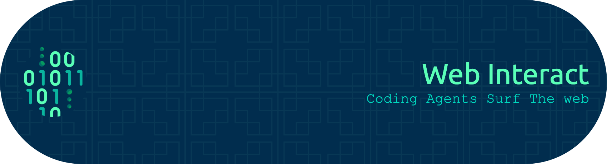

<div align="center">



<br />

[](https://github.com/johnkozaris/web-interact/actions/workflows/ci.yml)
[](https://www.npmjs.com/package/web-interact)
[](https://github.com/johnkozaris/web-interact/releases)
[](LICENSE)
[]()

</div>

---

Every browser action is a single shell command. Open a page, discover interactive elements by number, click, fill, screenshot — all from the terminal. No browser window needed, no scripts to write, no SDKs to learn.

Built for AI agents like Claude Code that think in commands, but just as useful for humans who want to automate forms, test web apps, scrape data, or take screenshots without writing Playwright scripts.

Under the hood: a Rust CLI talks to a Node.js daemon running Playwright (or optionally Patchright) with a QuickJS sandbox. The CLI auto-installs everything on first run — just install and go.

---

## Install

```bash
# npm (recommended)
npm install -g web-interact

# Shell installer (macOS/Linux)
curl --proto '=https' --tlsv1.2 -LsSf https://github.com/johnkozaris/web-interact/releases/latest/download/web-interact-installer.sh | sh

# PowerShell (Windows)
powershell -ExecutionPolicy ByPass -c "irm https://github.com/johnkozaris/web-interact/releases/latest/download/web-interact-installer.ps1 | iex"

# Cargo
cargo install web-interact
```

Runtime dependencies (Playwright + Chrome) auto-install on first run. No setup needed.

### Claude Code plugin

If you use Claude Code, add the plugin for seamless integration:

```
/plugin marketplace add johnkozaris/web-interact-plugin
```

Claude gets these skills automatically:

| Skill | What it does |
|-------|-------------|
| `/web-interact` | Full browser automation — navigate, discover, click, fill, screenshot |
| `/click-to-fix` | Click any element in your running app to trace it back to its source code. Uses React/Vue/Svelte/Angular dev metadata to find the component file, then opens it so you can review and fix |
| `/mode` | Switch between default (Playwright) and assistant (Patchright + humanize) engines |
| `/browser-mode` | Choose browser strategy — your own browser, managed sandbox, or auto |

---

## Quick start

```bash
web-interact open "https://example.com/login"
web-interact discover
# [1] input "Email"  [2] input[password] "Password"  [3] button "Sign in"

web-interact fill 1 "user@example.com"
web-interact fill 2 "password123"
web-interact click 3

web-interact get url
# → https://example.com/dashboard
```

## How it works

**Discover → Act → Verify.** Each command is one shell call. Element indices auto-refresh on navigation.

```bash
web-interact discover              # list interactive elements [1], [2], ...
web-interact click 3               # click by index (CDP mouse events)
web-interact fill 1 "text"         # clear + type into form field
web-interact type 2 "text"         # append to field (for autocomplete)
web-interact get url               # read current URL
web-interact screenshot --annotate # screenshot with numbered overlays
```

### Output contract

| Type | Behavior |
|------|----------|
| **Actions** (click, fill, press) | Silent on success (exit 0), error text on stderr (exit 1) |
| **Getters** (get url, eval) | Raw value to stdout |
| **Data** (tab list, cookies) | JSON to stdout |
| **Screenshots** | File path to stdout |
| **Large output** | Truncated at 128KB — use `--save <file>` for full |

---

## Commands

40+ commands covering the full browser automation surface:

| Category | Commands |
|----------|----------|
| **Navigate** | `open`, `tab new/switch/close`, `scroll`, `scrollintoview` |
| **Discover** | `discover`, `snapshot`, `find role/text/label/placeholder` |
| **Act** | `click`, `fill`, `type`, `select`, `check`, `uncheck`, `hover`, `press`, `dblclick`, `drag`, `upload` |
| **Read** | `get url/title/text/html/value/attr/visible/enabled/checked/count/styles/box` |
| **Screenshot** | `screenshot`, `screenshot --annotate`, `pdf` |
| **JavaScript** | `eval`, `wait` |
| **Network** | `network requests/block/route/unroute` |
| **Storage** | `storage local/session`, `cookies get/set/clear`, `clipboard read/write` |
| **Settings** | `set viewport/geo/offline/media/headers` |
| **Low-level** | `mouse move/click/down/up/wheel`, `keyboard type/insert/press/down/up` |
| **Console** | `console` (JS errors, warnings, logs) |
| **Inspect** | `click-to-fix` (click element → trace to source code) |
| **Config** | `mode default/assistant`, `browser-mode auto/real/sandbox` |
| **Manage** | `status`, `browsers`, `close`, `stop`, `install` |

---

## Modes

<table>
<tr><td>

### Interaction mode

```bash
# DOM mode (default) — discover + act by index
web-interact discover
web-interact click 3

# Vision — screenshot after each command
web-interact --vision click 3

# Annotated — numbered overlays on screenshot
web-interact --vision --annotate click 3
```

</td><td>

### Engine mode

```bash
web-interact mode              # show current
web-interact mode assistant    # Patchright + humanize
web-interact mode default      # Playwright (standard)
```

Assistant mode auto-enables `--humanize` with human-like delays between actions.

</td><td>

### Browser mode

```bash
web-interact browser-mode          # show current
web-interact browser-mode real     # your running browser
web-interact browser-mode sandbox  # managed + persistent
web-interact browser-mode auto     # CLI decides (default)
```

</td></tr>
</table>

---

## Flags

| Flag | Description |
|------|-------------|
| `--headless` | Run without visible window |
| `--browser NAME` | Named browser instance (default: `"default"`) |
| `--connect [URL]` | Connect to running Chrome/Edge |
| `--own-browser` | Use your running browser (shorthand for `--connect auto`) |
| `--humanize` | Natural delays between actions (auto in assistant mode) |
| `--vision` | Screenshot after each command |
| `--vision --annotate` | Annotated screenshot with element overlays |
| `--save FILE` | Write output to file instead of stdout |
| `--timeout SECONDS` | Script timeout (default: 20s) |
| `--page NAME` | Named page within browser |

---

## Examples

<details>
<summary><b>Fill a checkout form</b></summary>

```bash
web-interact open "https://shop.example.com/checkout"
web-interact discover
# [1] input "First name" ... [5] select "Country" ... [9] checkbox "Save" [10] button "Pay"

web-interact fill 1 "John"
web-interact fill 2 "Smith"
web-interact fill 3 "john@example.com"
web-interact select 5 "US"
web-interact fill 6 "123 Main St"
web-interact check 9
web-interact click 10
web-interact wait --url "**/confirmation"
```

</details>

<details>
<summary><b>Extract data with eval</b></summary>

```bash
web-interact open "https://news.example.com"
web-interact eval "Array.from(document.querySelectorAll('article')).map(a => ({
  title: a.querySelector('h2')?.textContent?.trim(),
  link: a.querySelector('a')?.href
})).filter(a => a.title)"
```

</details>

<details>
<summary><b>Mock API responses for testing</b></summary>

```bash
web-interact network route "*/api/users" --body '[{"id":1,"name":"Test User"}]'
web-interact open "https://app.example.com"
web-interact get text ".user-name"
# → Test User
```

</details>

<details>
<summary><b>Connect to your running browser</b></summary>

```bash
web-interact --own-browser discover
web-interact --own-browser screenshot --annotate
# Or persist: web-interact browser-mode real
```

</details>

<details>
<summary><b>Visual testing with --vision</b></summary>

```bash
web-interact --vision --annotate open "https://myapp.com"
# stderr: vision:/path/to/annotated.png (with [1], [2], etc.)
web-interact --vision click 3
# stderr: vision:/path/to/updated.png
```

</details>

---

## Contributing

See [CONTRIBUTING.md](CONTRIBUTING.md) for development setup, architecture, and build instructions.

## Authors

[**John Kozaris**](https://github.com/johnkozaris)

[**Edoardo Re**](https://github.com/edoardorex)

## License

MIT
